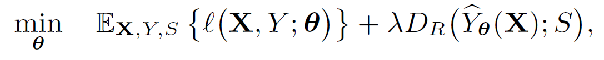

## Fair Empirical Risk Minimization Via Exponential Rényi Mutual Information
This repository is dedicated to implementation of Fair Empirical Risk Minimization (FERMI) algorithms proposed in . FERMI provides the first ****stochastic**** algorithm with theroretical convergence guarantees for promoting fairness in classification tasks. To balance the accuracy and fairness, **fair risk minimization through exponential Rényi mutual information** framework minimizes the following objective function:

<div align='center'> 

</div>

where the first term represents the population risk (accuracy) and the second term is a regularizer promoting exponential Rényi mutual information (ERMI) between the sensitive attribute(s) and predictions. Note that ERMI is a stronger notion of fairness compared to existing notions of fairness such as mutual information [Kamishima et al., 2011, Rezaei et al., 2020, Steinberget al., 2020, Zhang et al., 2018, Cho et al., 2020a], Pearson correlation [Zafar et al., 2017], false positive/negative rates[Bechavod and Ligett, 2017], Hilbert Schmidt independence criterion (HSIC) [Pérez-Suay et al., 2017], and Rényicorrelation [Baharlouei et al., 2020, Grari et al., 2020, 2019], in the sense that it upper bounds all aforementioned notions. Thus, minimizing ERMI guarantees the fairness of model under those notions. In the following table we compare FERMI with several state-of-the-art approaches in the literature. 


**Reference** | **NB Target** | **NB Attribute** | **NB both exp.** | **Cont. Target** | **Violation Notion** | **Unbiased Stoch. Alg** | **Convergence Guarantee**
:-: | :-: | :-: | :-: | :-: | :-: | :-: | :
Sotchastic FERMI | :heavy_check_mark: | :heavy_check_mark: | :heavy_check_mark: | :heavy_check_mark: | dp, eod, MI, RC, ERMI | :heavy_check_mark: | O(ε<sup>-4</sup>) (Stoch)
Batch FERMI | :heavy_check_mark: | :heavy_check_mark: | :heavy_check_mark: | :heavy_check_mark: | dp, eod, MI, RC, ERMI | :x: | O(ε<sup>-4</sup>) (Batch)
Cho et al. [2020a] | :heavy_check_mark: | :heavy_check_mark: | :x: | :x: | dp, eod, MI | :heavy_check_mark: | :x:
Cho et al. [2020b] | :heavy_check_mark: | :heavy_check_mark: | :heavy_check_mark: | :x: | dp, eod | biased | :x:
Baharlouei et al. [2020] | :heavy_check_mark: | :heavy_check_mark: | :x: | :x: | dp, eod, RC | :x: | O(ε<sup>-4</sup>) (Batch)
Rezaei et al. [2020] | :x: |  :x: | :x: | :x: | dp, eod | :x: | :x:
Jiang et al. [2020] | :x: | :heavy_check_mark: | :x: | :x: | dp | :x: | :x:
Donini et al. [2018] | :x: | :heavy_check_mark: | :x: | :x: | eod | :x: | :x:
Zhang et al. [2018] | :heavy_check_mark: | :heavy_check_mark: | :x: | :heavy_check_mark: | dp, eod | biased | :x:

Where NB, Cont., Stoch, dp, eod, MI, and RC stand for non-binary, continuous, stochastic, demomgraphic parity, equalized odds, Mutual Information and Rényi Correlation respectively. 

## Dependencies
The following packages must be installed via Anaconda or pip before running the codes. Download and install **Python 3.x version** from [Python 3.x Version](https://www.python.org/downloads/):
Then install the following packages via Conda or pip:
* [Numpy](https://pandas.pydata.org/pandas-docs/stable/getting_started/install.html)
* [Pandas](https://anaconda.org/conda-forge/matplotlib)
* [Scikit learn](https://scikit-learn.org/stable/install.html)
* [Matplotlib](https://matplotlib.org/stable/users/installing.html)
* [PyTorch](https://pytorch.org/get-started/locally/)


## Binary Classification with Binary Sensitive Attribute 
To run the code for a binary classification problem with a binary sensitive attribute use the following command:  

```
python BinaryClassification/Binary_FERMI.py 
```


## Stochastic FERMI for Large-scale Neural Networks on Datasets with Multiple Sensitive Attributes
The implementation of Algorithm 1 in [paper](https://www.google.com), specialized to a 4-layer neural network on color mnist dataset can be found in NeuralNetworkMnist folder. You can run it on color mnist dataset via:

```
python NeuralNetworkMnist/code_cm.py 
```

